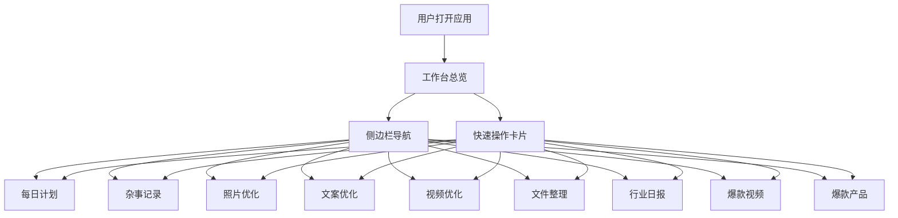

## 1. 产品概述

个人工作站是一款集任务管理、内容创作、信息聚合于一体的个人效率工具应用，为用户提供统一的工作台界面，帮助用户高效管理日常工作和生活。

- **主要用途**：个人任务管理、内容创作优化、行业资讯获取、文件整理
- **目标用户**：需要高效管理日常工作的个人创作者、运营人员、自由职业者
- **产品价值**：一站式解决个人效率问题，减少工具切换成本，提升工作效率

## 2. 核心功能

### 2.1 用户角色

| 角色 | 注册方式 | 核心权限 |
|------|----------|----------|
| 个人用户 | 本地使用（无需注册） | 使用全部功能，数据本地存储 |

### 2.2 功能模块

1. **工作台总览**：欢迎卡片、日历、天气、快速操作、今日提醒、最近动态、行业日报预览
2. **每日计划**：任务列表、任务添加/编辑/删除、任务状态切换、任务优先级、日期切换
3. **杂事记录**：笔记列表、笔记添加/编辑/删除、笔记分类、搜索功能
4. **照片优化**：照片上传、AI优化、滤镜效果、尺寸调整、导出下载
5. **文案优化**：文案输入、AI润色、风格选择、字数统计、复制导出
6. **视频优化**：视频上传、剪辑、滤镜、转场效果、导出
7. **文件整理**：文件列表、分类管理、上传下载、存储空间统计
8. **行业日报**：资讯列表、分类筛选、收藏、阅读标记
9. **爆款视频趋势**：热门视频榜单、平台分类、数据趋势、视频详情
10. **爆款产品洞察**：热门产品榜单、品类分析、价格趋势、产品详情

### 2.3 页面详情

| 页面名称 | 模块名称 | 功能描述 |
|----------|----------|----------|
| 工作台总览 | 欢迎卡片 | 显示问候语、日期、任务完成进度、统计数据卡片 |
| 工作台总览 | 日历小组件 | 显示当月日历，标记当天日期 |
| 工作台总览 | 天气小组件 | 显示当前位置、7天天气预报 |
| 工作台总览 | 快速操作 | 9个功能入口卡片，点击跳转对应页面 |
| 工作台总览 | 今日提醒 | 显示今日待办任务列表，支持优先级标识 |
| 工作台总览 | 最近动态 | 显示最近操作记录时间线 |
| 工作台总览 | 行业日报预览 | 显示最新行业资讯摘要 |
| 每日计划 | 任务列表 | 按日期显示任务，支持完成/待办状态切换 |
| 每日计划 | 任务管理 | 添加、编辑、删除任务，设置优先级和截止时间 |
| 每日计划 | 日历视图 | 月视图日历，标记有任务的日期 |
| 杂事记录 | 笔记列表 | 卡片式笔记展示，支持分类筛选 |
| 杂事记录 | 笔记编辑 | 富文本编辑、标签管理 |
| 照片优化 | 图片上传 | 拖拽/点击上传图片 |
| 照片优化 | 优化功能 | AI增强、滤镜、裁剪、调整参数 |
| 文案优化 | 文案编辑 | 输入文案、选择优化风格 |
| 文案优化 | AI优化 | 一键润色、改写、扩写 |
| 视频优化 | 视频上传 | 上传视频文件 |
| 视频优化 | 视频编辑 | 剪辑、滤镜、转场、字幕 |
| 文件整理 | 文件列表 | 网格/列表视图，分类浏览 |
| 文件整理 | 文件操作 | 上传、下载、删除、重命名 |
| 行业日报 | 资讯列表 | 按分类展示行业资讯 |
| 行业日报 | 资讯详情 | 阅读全文、收藏、分享 |
| 爆款视频趋势 | 视频榜单 | 热门视频排行榜，平台筛选 |
| 爆款视频趋势 | 数据分析 | 播放量、点赞数、评论数趋势图 |
| 爆款产品洞察 | 产品榜单 | 热销产品排行，品类筛选 |
| 爆款产品洞察 | 产品分析 | 价格趋势、销量数据、用户评价 |

## 3. 核心流程

### 3.1 用户主流程

用户打开应用 → 进入工作台总览 → 查看今日任务和动态 → 通过侧边栏或快速操作进入对应功能页面 → 完成操作后返回工作台

### 3.2 任务管理流程

进入每日计划 → 查看今日任务 → 点击添加新任务 → 填写任务信息（标题、优先级、截止时间）→ 保存任务 → 点击任务切换完成状态

### 3.3 内容优化流程

进入对应优化页面（照片/文案/视频）→ 上传或输入内容 → 选择优化方式 → 等待处理 → 预览效果 → 导出/保存结果

## 4. 用户界面设计

### 4.1 设计风格

- **设计系统**：Pinguo Design System（Apple 风格）
- **主色调**：品牌蓝 #007AFF（System Blue）
- **辅助色**：
  - 暖橙 #d97757（用于强调和高亮）
  - 蓝色 #6a9bcc（用于信息类元素）
  - 绿色 #788c5d（用于成功/完成状态）
  - 米色 #faf9f5（卡片背景）
- **按钮样式**：圆角胶囊按钮，主按钮实色填充，次按钮虚化背景
- **字体**：
  - 标题：Poppins（无衬线，现代感）
  - 正文：Lora（衬线，优雅感）
  - 等宽：JetBrains Mono（数据展示）
- **布局风格**：侧边栏导航 + 顶部栏 + 卡片式内容区
- **图标风格**：线性简洁图标，使用 mask-image 技术实现颜色可控
- **圆角**：大圆角设计（1.2rem），营造柔和精致感
- **阴影**：多层级柔和阴影，提升层次感
- **毛玻璃效果**：backdrop-filter 模糊效果，现代感强

### 4.2 页面设计概览

| 页面名称 | 模块名称 | UI 元素 |
|----------|----------|----------|
| 工作台总览 | 欢迎卡片 | 渐变米色背景、统计数据卡片、进度条、悬停动效 |
| 工作台总览 | 日历 | 网格布局、当天高亮、悬停效果 |
| 工作台总览 | 天气 | 地图占位、7天预报、emoji天气图标 |
| 工作台总览 | 快速操作 | 3列网格、图标+文字+箭头、悬停上浮 |
| 工作台总览 | 今日提醒 | 列表式、左侧色条标识优先级、完成态删除线 |
| 工作台总览 | 最近动态 | 时间线式列表、图标+描述+时间 |
| 侧边栏 | 导航菜单 | 渐变背景、左侧激活条、拖拽排序、悬停高亮 |
| 顶部栏 | 标题栏 | 毛玻璃背景、日期显示、主题切换、用户头像 |

### 4.3 响应式设计

- **设计策略**：桌面端优先，移动端适配
- **断点设置**：
  - 桌面端：≥ 1280px（侧边栏展开，3列布局）
  - 平板端：768px - 1279px（侧边栏可收起，2列布局）
  - 移动端：< 768px（底部Tab导航，单列布局）
- **移动端适配**：
  - 侧边栏转为底部标签栏
  - 网格布局改为单列
  - 卡片尺寸自适应
  - 触摸友好的按钮尺寸（≥44px）
- **主题切换**：支持浅色/深色模式，跟随系统或手动切换

### 4.4 交互动效

- **页面切换**：平滑淡入淡出过渡
- **卡片悬停**：轻微上浮 + 阴影加深
- **按钮反馈**：点击缩放、颜色变化
- **侧边栏**：菜单项滑入高亮、拖拽排序
- **任务切换**：完成态打勾动画 + 文字删除线
- **进度条**：渐变填充动画
- **主题切换**：平滑颜色过渡
