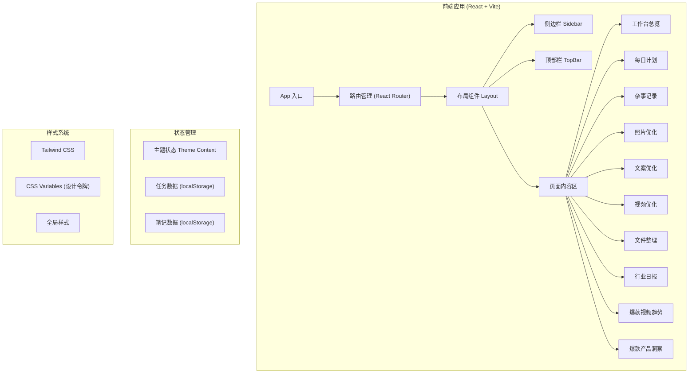

## 1. 架构设计



## 2. 技术描述

- **前端框架**：React 18 + TypeScript
- **构建工具**：Vite 5
- **样式方案**：Tailwind CSS 3 + CSS Variables
- **路由管理**：React Router DOM 6
- **状态管理**：React Context + useState + useReducer
- **本地存储**：localStorage（持久化用户数据）
- **图标方案**：SVG Icons + CSS mask-image 技术
- **字体**：Google Fonts (Poppins + Lora + JetBrains Mono)
- **后端**：无（纯前端应用，数据本地存储）
- **数据库**：localStorage（模拟数据持久化）

## 3. 路由定义

| 路由路径 | 页面名称 | 说明 |
|----------|----------|------|
| `/` | 工作台总览 | 首页，展示欢迎卡片、日历、天气、快速操作等 |
| `/tasks` | 每日计划 | 任务管理页面 |
| `/notes` | 杂事记录 | 笔记管理页面 |
| `/photo` | 照片优化 | 图片优化工具页面 |
| `/copywriting` | 文案优化 | 文案优化工具页面 |
| `/video` | 视频优化 | 视频优化工具页面 |
| `/files` | 文件整理 | 文件管理页面 |
| `/news` | 行业日报 | 资讯浏览页面 |
| `/trending-video` | 爆款视频趋势 | 视频趋势分析页面 |
| `/trending-product` | 爆款产品洞察 | 产品洞察分析页面 |

## 4. 数据模型

### 4.1 任务数据模型 (Task)

```typescript
interface Task {
  id: string;
  title: string;
  description?: string;
  priority: 'high' | 'medium' | 'low';
  status: 'pending' | 'completed';
  dueDate: string; // ISO date string
  createdAt: string;
  completedAt?: string;
}
```

### 4.2 笔记数据模型 (Note)

```typescript
interface Note {
  id: string;
  title: string;
  content: string;
  tags: string[];
  category: string;
  createdAt: string;
  updatedAt: string;
}
```

### 4.3 文件数据模型 (FileItem)

```typescript
interface FileItem {
  id: string;
  name: string;
  type: 'image' | 'video' | 'document' | 'other';
  size: number; // bytes
  category: string;
  uploadDate: string;
  url?: string;
}
```

### 4.4 资讯数据模型 (NewsItem)

```typescript
interface NewsItem {
  id: string;
  title: string;
  summary: string;
  content: string;
  category: string;
  source: string;
  publishDate: string;
  isRead: boolean;
  isFavorite: boolean;
}
```

### 4.5 主题状态 (Theme)

```typescript
type ThemeMode = 'light' | 'dark' | 'system';

interface ThemeState {
  mode: ThemeMode;
  isDark: boolean;
}
```

## 5. 项目目录结构

```
/workspace
├── src/
│   ├── components/          # 公共组件
│   │   ├── layout/         # 布局组件
│   │   │   ├── Sidebar.tsx
│   │   │   ├── TopBar.tsx
│   │   │   └── Layout.tsx
│   │   └── ui/             # UI 组件
│   │       ├── Button.tsx
│   │       ├── Card.tsx
│   │       ├── Input.tsx
│   │       └── Icon.tsx
│   ├── pages/              # 页面组件
│   │   ├── Dashboard.tsx
│   │   ├── Tasks.tsx
│   │   ├── Notes.tsx
│   │   ├── Photo.tsx
│   │   ├── Copywriting.tsx
│   │   ├── Video.tsx
│   │   ├── Files.tsx
│   │   ├── News.tsx
│   │   ├── TrendingVideo.tsx
│   │   └── TrendingProduct.tsx
│   ├── context/            # Context 状态管理
│   │   └── ThemeContext.tsx
│   ├── hooks/              # 自定义 Hooks
│   │   ├── useLocalStorage.ts
│   │   └── useTheme.ts
│   ├── data/               # Mock 数据
│   │   ├── tasks.ts
│   │   ├── notes.ts
│   │   ├── news.ts
│   │   └── files.ts
│   ├── styles/             # 全局样式
│   │   └── index.css
│   ├── types/              # TypeScript 类型定义
│   │   └── index.ts
│   ├── utils/              # 工具函数
│   │   └── index.ts
│   ├── App.tsx
│   ├── main.tsx
│   └── vite-env.d.ts
├── public/                 # 静态资源
│   └── icons/              # SVG 图标
├── index.html
├── package.json
├── tsconfig.json
├── vite.config.ts
├── tailwind.config.js
└── postcss.config.js
```

## 6. 核心技术实现

### 6.1 主题切换系统

- 使用 CSS Variables 定义设计令牌
- 通过 `data-theme` 属性切换主题
- 支持浅色/深色/跟随系统三种模式
- 主题偏好持久化到 localStorage

### 6.2 响应式布局

- 桌面端：侧边栏固定（240px）+ 内容区自适应
- 平板端：侧边栏可折叠，2列网格
- 移动端：底部Tab导航，单列布局
- 使用 Tailwind 响应式断点：sm / md / lg / xl

### 6.3 数据持久化

- 使用 localStorage 存储用户数据
- 自定义 useLocalStorage Hook 简化操作
- 初始化时从 localStorage 加载数据
- 数据变更时自动保存

### 6.4 交互动效

- CSS Transitions 实现平滑过渡
- 卡片悬停效果（上浮 + 阴影加深）
- 页面切换淡入淡出
- 任务完成动画（打勾 + 删除线）
